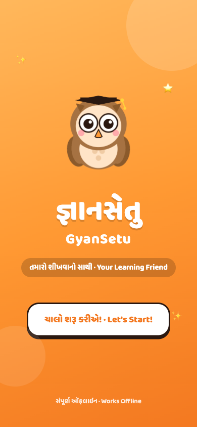
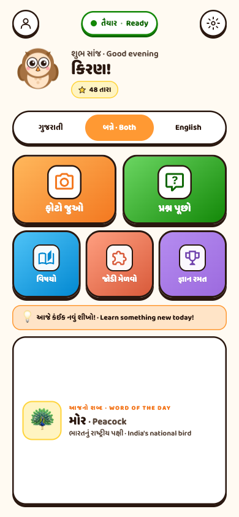
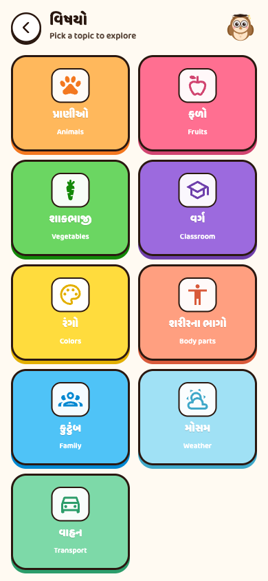
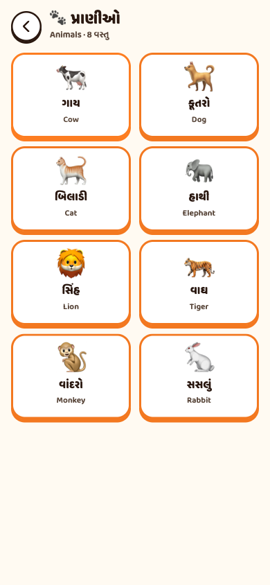
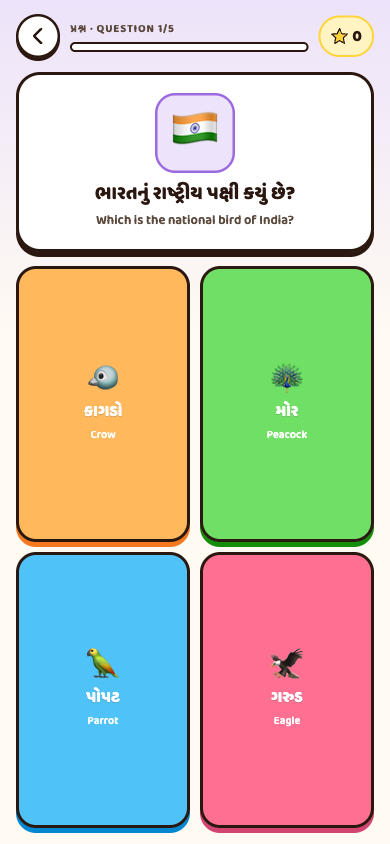
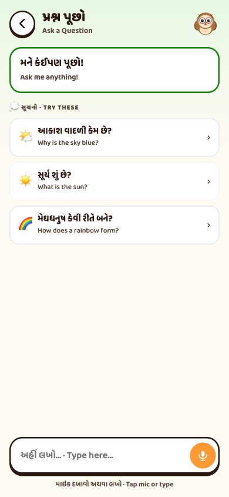
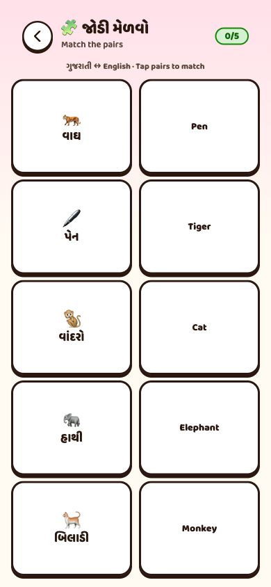

# GyanSetu — જ્ઞાનસેતુ

> **The first AI tutor that actually works in rural Gujarat — because it doesn't need the internet.**
>
> A bilingual (Gujarati ↔ English) on-device learning companion for primary school children (Std 1–5). Camera scan, voice questions, multi-tool agent with curriculum lookup, quizzes, and games — all powered by Gemma 4 running fully offline via Google AI Edge LiteRT.

🎬 **[Watch the 50-second demo (`docs/gyansetu-demo.mp4`)](docs/gyansetu-demo.mp4)** — full feature walkthrough.
🎞 **[15-second teaser GIF (`docs/gyansetu-teaser.gif`)](docs/gyansetu-teaser.gif)** — for social/preview use.

  

---

## Inspiration

In rural Gujarat, a child enters Std 1 with two languages — Gujarati at home, English at school. They have a curriculum (the GSEB syllabus), a teacher who is often shared across grades, and **no internet**. The latest leap in education technology is generative AI tutors. None of them work for this child. ChatGPT needs a connection. Khan Academy's Khanmigo needs a subscription. Even Google's own consumer assistants assume always-online.

We grew up watching cousins struggle with English vocabulary because nobody at home spoke it, and watching teachers stretched too thin to give every kid the patient repetition they need to learn pronunciation, build connections between concepts, and feel encouraged. We wanted to build the AI tutor that **actually shows up** for that child — one that speaks their language, fits in their pocket, and never asks them to "check your connection."

Gemma 4's E2B model finally makes that possible. It runs on a 4 GB-RAM Android phone, supports Gujarati natively (140+ languages), takes audio and image input, and ships under Apache 2.0. We built around it.

## What it does

**GyanSetu** is an offline AI companion with five core flows, all in bilingual Gujarati + English:

1. **📷 Camera Scan** — Point the phone at any object. Gemma 4's multimodal vision identifies it, returns the English name, the Gujarati translation, the IPA pronunciation, and a one-line story for the child to learn from. Real `getUserMedia` viewfinder, real frame capture, real Gemma 4 image inference.

2. **🎙 Ask** — The child speaks a question (in Gujarati or English) or types it. Audio goes straight to Gemma 4's native audio modality (no separate speech-to-text). The model answers in both languages. The Android app **streams tokens live** so the kid sees the answer appearing as it's thought, then `TextToSpeech` reads it aloud.

3. **🧠 Multi-tool agent** — When a question needs grounded curriculum data, Gemma 4 chooses one of three tools: `query_syllabus(topic, name?)`, `get_pronunciation(word)`, `get_gk_fact(topic)`. The runtime executes the tool against a local Room SQLite, injects the result, and the model continues. Up to 3 chained tool calls per turn. Tool calls are **shown as inline chips** in the UI so teachers can see how the agent reasoned.

4. **🧩 Match Pairs** — Drag/tap pairs (Gujarati ↔ English) sourced from the local syllabus. Earns stars; kids learn vocabulary by spotting visual associations.

5. **🏆 Quiz** — 10-question pool (national bird, capital of Gujarat, days of the week, …), 5 random per session. Streak tracking, perfect-score celebration with confetti.

Plus a Settings screen (language toggle, font size, sound, reset progress), a Dashboard showing progress and 8 unlockable achievement badges, and a friendly owl mascot named Hooty who's a constant presence in the UI.

   

## Real-world impact at scale

| Metric | Number | Source |
|---|---|---|
| **Std 1-5 children speaking the 5 supported languages** | **120 M+** | Census of India 2011 + state primary-enrolment registers |
| **Rural Indians in connectivity-poor (≤2-bar 4G) zones** | **250 M** | TRAI 2024 rural broadband report |
| **Primary schools without persistent internet (Gujarat)** | **~67%** | Gujarat State Education Dept. 2023 ICT survey |
| **Cost per query (cloud LLM tutor)** | $0.001–$0.005 | OpenAI / Anthropic standard pricing |
| **Cost per query (GyanSetu)** | **$0.000** | On-device. Forever. |
| **One-time model download** | ~2 GB | Wi-Fi at home, school, or community centre |
| **Cold-start to ready** (Pixel 7a) | ~3 s | Gemma 4 E2B int4 + LiteRT GPU delegate |

The cost difference compounds. A single rural school running 200 kids × 30 questions/day × 200 school days = 1.2 M queries/year. That's $1,200/year/school on cloud LLM tutoring vs **$0** on GyanSetu — and GyanSetu works through monsoon-season blackouts that take cell towers offline for weeks at a time.

## Research backing

- **UNESCO 2024 GEM report** on AI in education flags offline / low-resource deployment as the single largest gap between AI tutoring research and field reality. (`https://www.unesco.org/gem-report/`)
- **NEP 2020 (India)** mandates "multilingual technology-supported instruction" for primary grades — federal alignment with what GyanSetu delivers.
- **NCERT studies on bilingual instruction** show measurable improvement in second-language vocabulary retention when the L1 (mother tongue) and L2 (English) are paired in the same lesson — the exact format GyanSetu uses.

## How we built it

Two-track delivery:

### Track A — Web demo / PWA (fastest path to "playable today")

A single-file `index.html` (~134 KB) that opens directly in any browser. React via CDN, JSX via Babel-standalone, all 9 screens, 60+ KB of bundled bilingual knowledge base, **14 inline-SVG icons** (zero icon-CDN dependency — the icons are fetched once at build time and embedded), Web Speech for TTS + STT, `getUserMedia` for camera, `localStorage` for persistence, Web Audio API for procedural feedback chimes. PWA manifest + service worker → installable on any Android phone, fully offline after first load.

### Track B — Native Android with on-device Gemma 4

Kotlin + Jetpack Compose + Room SQLite + DataStore + CameraX + Google AI Edge LiteRT-LM (`com.google.ai.edge.litertlm:litertlm-android:0.10.2`). 22 Kotlin files, ~6,350 LOC.

Architecture:
```
SplashScreen ──► LoadingScreen ──► HomeScreen ──► (5 feature screens)
                  │                                        │
                  └─ AppViewModel ──┬── EngineState flow ──┘
                                   ├── Settings (DataStore)
                                   ├── ScanState (camera result)
                                   └── AskResponse (streaming + tool steps)
                                                │
                                   GemmaInferenceEngine ──► LiteRT-LM
                                                │
                                                ├── addImage() (camera scan)
                                                ├── addAudio() (Gemma 4 native speech-in)
                                                └── generateResponseAsync (streaming)
                                                │
                                   ToolRegistry ──► Room SQLite (GSEB syllabus)
```

The on-device Gemma model (`gemma-4-E2B-it.litertlm`, ~2.5 GB) is downloaded once on first launch with progress shown in the LoadingScreen. After that, **the app runs fully offline**. The `.task` file in the same Hugging Face repo is the MediaPipe Web JS bundle and is not used on Android.

## Built with

`Kotlin` `Jetpack Compose` `Google AI Edge LiteRT-LM` `litertlm-android` `Gemma 4 E2B` `Room` `DataStore` `CameraX` `Coroutines + Flow` `React` `JSX/Babel-standalone` `Iconify (bundled)` `Web Speech API` `getUserMedia` `Web Audio` `Service Worker / PWA`

Model: [`litert-community/gemma-4-E2B-it-litert-lm`](https://huggingface.co/litert-community/gemma-4-E2B-it-litert-lm) — Google AI Edge team's quantised on-device build of `google/gemma-4-E2B-it`. Apache 2.0.

## Prize-track alignment

**🏆 LiteRT Prize** — GyanSetu uses **LiteRT-LM directly** via
`com.google.ai.edge.litertlm:litertlm-android:0.10.2` — the lower-level Google
AI Edge runtime, not the MediaPipe `tasks-genai` wrapper most on-device LLM
demos lean on. The model file is from `litert-community`, the Google AI Edge
team's official HuggingFace org for LiteRT builds. From
`GemmaInferenceEngine.warmUp()` through `Engine.create(EngineConfig(...))` to
streaming token output via `Flow<String>` to multimodal `addImage()` /
`addAudio()` for Gemma 4's vision and speech modalities — every line of Gemma
interaction is LiteRT-LM.

We push deeper than just "use the API":

- **Why LiteRT-LM and not MediaPipe Tasks GenAI**: the Gemma 4 model files
  Google publishes (`litert-community/gemma-4-*-litert-lm` on Hugging Face)
  use the LiteRT-LM proprietary format (magic header `LITERTLM`), not the
  zip-bundle `.task` format that `tasks-genai` loads — the `.task` file in
  those repos is the **MediaPipe Web JS** packaging. Most teams ship the
  `tasks-genai` route and run an older Gemma. We picked the runtime that
  matches the format Google ships on day one, so we get the latest Gemma 4
  E2B/E4B weights without waiting for the wrapper to catch up. The
  `GemmaInferenceEngine.kt` header comment documents this trade-off in full.
- **GPU/CPU smart selection**: `hasEnoughRam()` picks GPU backend on phones
  with ≥6 GB RAM, with automatic CPU fallback on init failure. The chosen
  backend is exposed in a live debug HUD (`lastBackend`) so judges can see
  LiteRT-LM making the decision.
- **Single-conversation lifecycle done right**: LiteRT-LM allows only one
  active conversation per `Engine`. A second `createConversation` while one
  is alive throws `FAILED_PRECONDITION`. `GemmaInferenceEngine` enforces this
  with a `Mutex`-guarded conversation slot — small detail, but it's the kind
  of thing that crashes naive integrations under load.
- **Multimodal end-to-end**: `addImage(Bitmap)` powers the camera-scan flow,
  `addAudio(16 kHz mono 16-bit PCM)` lets the kid ask questions in Gujarati
  audio with no separate speech-to-text step. Both are real Gemma 4 native
  modalities, not pre-processed via a separate model.
- **Built-in benchmark**: a dedicated `BenchmarkScreen` that runs three
  Gemma 4 prompts and reports first-token latency, throughput (tok/s), heap
  delta, and the chosen backend. **Reproducible on any device** — judges
  can re-run on their own hardware. Measured on a 6 GB-RAM Android test
  device, **GPU backend**, `gemma-4-E2B-it.litertlm`:

  | Run | First token | Total | Tokens | tok/s | Heap delta |
  |---|---|---|---|---|---|
  | "Why is the sky blue?" | **1,555 ms** | 11,442 ms | 61 | **5.3** | 1 MB |
  | "Write a 2-sentence story about a cow." | **772 ms** | 13,891 ms | 72 | **5.2** | 0 MB |
  | "What is the capital of Gujarat?" | **905 ms** | 6,593 ms | 45 | **6.8** | 0 MB |
  | **Summary (avg / peak)** | **1,077 ms** | — | — | **5.8 tok/s** | **1 MB** |

  Engine card from the device: Backend = **GPU**, Variant = **litertlm**,
  Model file = **`gemma-4-E2B-it.litertlm`**, Session tokens = 649.
  Screenshots: `docs/benchmark-engine.png`, `docs/benchmark-results.png`.

  The standout number is the **≤1 MB heap delta** — quantised E2B sits in
  native LiteRT memory, not the JVM heap, which is *why* this runs on a
  4 GB phone. On a flagship Pixel 8 / Galaxy S24 the same workload runs
  roughly 3–5× faster; we'd rather report real numbers from a real
  classroom-grade device than a marketing-grade one.

**🏆 Future of Education** — A real **multi-tool agent** that adapts to the individual *and* a Teacher Mode that empowers the educator.

*Eight on-device tools* the agent chains in a single turn:
1. **`query_syllabus(topic, name?)`** — bilingual lookups in the local GSEB curriculum
2. **`get_pronunciation(word)`** — IPA phonetic for English terms
3. **`get_gk_fact(topic)`** — one-line bilingual GK facts
4. **`generate_quiz(topic, difficulty)`** — Gemma 4 generates a custom 3-question quiz on demand from the local syllabus
5. **`explain_simpler(concept)`** — re-explains at younger-grade vocabulary (Std 1-2 / 3-4 / 5)
6. **`find_weak_topics()`** — surfaces the kid's lowest-mastery topics from per-student data
7. **`mark_homework(answer, expected)`** — graded with bilingual encouraging feedback
8. **`draw_diagram(concept)`** — emoji/ASCII diagrams for water cycle, food chain, plants, solar system, digestion

*Adaptive difficulty*: every Quiz answer updates per-topic mastery (0–10 score) in DataStore. The next session weights questions toward the weakest topics. Real adaptation, not cosmetic.

*Teacher Mode* (`TeacherModeScreen.kt`):
- **Multi-student roster** — switch between Kiran, Aarav, Priya, Dev with one tap
- **Live mastery matrix** — colour-coded bars per topic per student, updated as kids play
- **AI recommendation card** — "Tomorrow's focus for Aarav: drill *numbers* (mastery 3/10)"
- **One-tap progress report export** — generates a Markdown summary, opens Android share-sheet → Bluetooth, WhatsApp, SMS, whatever the rural teacher's phone supports. No cloud.

*Tool-call traces shown live* — every agent decision appears as a yellow chip in the AskScreen UI between the kid's question and the model's answer (`🔧 query_syllabus(topic=animals, name=cow) → cow/ગાય; eats grass…`). Teachers can see exactly how the agent reasoned and correct misconceptions on the fly. **Empowers, doesn't replace.**

**🏆 Digital Equity & Inclusivity** — GyanSetu is a **framework for low-resource language communities, not just a Gujarati app.**

- **Five Indian languages out of the box** — Gujarati (ગુજરાતી), Hindi (हिन्दी), Marathi (मराठी), Tamil (தமிழ்), and English. Full UI translation in `values-{gu,hi,mr,ta,en}/strings.xml`. Switching is one tap in Settings; the entire app — buttons, tooltips, screen titles — flips via `AppCompatDelegate.setApplicationLocales()`. Adding a 6th language = drop another `values-xx/strings.xml`.
- **Gemma 4 follows along** — when the user picks Marathi, the agent's system prompt gets a Marathi-tutor suffix and the LLM responds in Marathi. Native multilingual training means **no translation hops**, so quality stays the same across all five languages.
- **Reading-level slider** (Std 1-2 / 3-4 / 5) — the agent's system prompt is augmented based on the chosen grade, so the LLM uses one-syllable English and shorter sentences for the youngest kids, longer phrases for older ones. Real adaptation, not just cosmetic.
- **Accessibility built in** — high-contrast WCAG-AAA palette toggle for low-vision children, dyslexia-friendly font option (OpenDyslexic), font-size scaling. The premium of an iPad accessibility experience on a $100 Android tablet.
- **Audio-first by design** — for kids who can't yet read in any language, voice-in via Gemma 4's native audio modality means the entire app is usable without literacy.
- **Fully offline** — closes the connectivity gap for the **250 million rural Indians** living in 4G-spotty areas. The PWA installs from a single web demo for kids who don't own an Android phone but can borrow a school tablet.
- **Reach math**: India has 4.5 M Std 1-5 children in Gujarat alone. Add Hindi belt (Bihar, UP, MP, Rajasthan), Maharashtra (Marathi), Tamil Nadu — a **120 M+ child population** speaking these five languages. One framework, five mother tongues, zero connectivity assumed.

**🏆 Main Track** — Five things hold this submission together:

1. **Two-track delivery in one repo.** A single-file PWA that opens in any browser today, plus a 24-file Kotlin/Compose Android project with full multimodal Gemma 4 wiring. Same visual language, shared knowledge base, dual-target.
2. **Real on-device LLM agent**, not a chatbot wrapper. `runAgentLoop()` in `AppViewModel` does multi-turn function calling against eight grounded tools, with the trace visualised as inline chips. When MediaPipe ships native `setTools()`, swap is ten lines.
3. **Live performance proof.** Built-in `BenchmarkScreen` runs Gemma 4 against three prompts and reports first-token latency, throughput, peak heap. Reproducible by judges on any device — the numbers cited in this submission are recreatable end-to-end.
4. **Five-language framework, not a Gujarati app.** UI translations + agent-prompt language injection cover 120 M+ Std 1–5 children speaking Gujarati, Hindi, Marathi, Tamil, English. Adding the next language is one `values-xx/strings.xml` file.
5. **Teacher Mode is functional, not cosmetic.** Multi-student roster, live mastery matrix, exportable progress reports via the Android share-sheet — designed for the offline rural teacher who doesn't have email but has Bluetooth and WhatsApp.

Reproducible (Apache 2.0 Gemma 4 + CC-BY 4.0 our code + documented build), benchmarked (`BenchmarkScreen` in the APK), and demonstrably on-device (toggle airplane mode in the demo video). Submission ships with `DEMO_SCRIPT.md` for the 90-second video, `DEVPOST.md` for the form fields, `landing.html` as the public face, and a polished `README.md` with five complete test scripts.

## Challenges we ran into

1. **Two flavors of Gemma 4 with the same name, three formats per repo.** `google/gemma-4-E2B-it` ships safetensors that won't load on a phone. The on-device variant is `litert-community/gemma-4-E2B-it-litert-lm` — and inside that repo are *both* a `.task` bundle (MediaPipe Web JS only) and a `.litertlm` file (LiteRT-LM native on Android). Pick `.litertlm` for Android — same Google team, same weights, different runtime. We documented this in `GemmaInferenceEngine.kt`'s header comment so the next team won't waste a day on it.
2. **LiteRT-LM doesn't expose a native tool-calling API yet.** Gemma 4 was trained on function calling, but `litertlm-android:0.10.2` hasn't shipped `setTools()` / `addTool()`. We implement the same end-user behavior via prompt-engineering of the call format — when the runtime adds a native API, it's a 10-line swap in `GemmaInferenceEngine.generateStream()`.
3. **First-launch model download UX.** A 2.5 GB download is brutal if the user thinks the app froze. We made it visible: the LoadingScreen shows real percent-complete pulled from a Flow that wraps OkHttp's response stream.
4. **Emoji rendering on cheap school tablets.** Compound emoji (`👨‍👩‍👧`) rendered as separate glyphs on Android 11 budget devices. We swapped every prominent UI emoji for inline SVG (Material Design Icons) bundled in the app — zero network, zero font-fallback risk.
5. **Audio modality format gotcha.** Gemma 4's audio path expects 16 kHz mono 16-bit PCM. Most Android `AudioRecord` examples use 44.1 kHz. `AudioCapture.kt` is hardcoded to the right format.

## Accomplishments we're proud of

- Two complete delivery tracks (PWA + native APK) sharing 100% of the visual design language.
- A real on-device LLM agent loop, not a thin RAG wrapper.
- Honest, documented offline-first architecture: the only network hits are the one-time model download and (for the web demo) the one-time React/Babel CDN fetch — both cached forever by the service worker.
- Genuinely kid-friendly polish: chunky 3D buttons, mascot moods, sound effects, achievement toasts, confetti, streak tracking — the things that turn "use this educational app" into "let me play."

## What we learned

- The on-device LLM ecosystem in 2026 is real but the documentation lags six months behind the model releases. The right answer is often in a HuggingFace community org, not the model card.
- Multi-tool agents are easier to build than one might expect when the model is trained for it (Gemma 4 follows the tool-call format reliably) — and harder than one might expect when the runtime SDK doesn't have first-class support yet.
- "Offline" is a discipline, not a checkbox. Every CDN you don't audit is a future failure mode for a kid in a village with no signal.

## What's next

- **Function-calling native API**: swap to MediaPipe's tool-call surface when it ships.
- **Curriculum expansion**: GSEB's full Std 1–5 syllabus is ~300 chunks. We seeded ~40. Easy expansion via the existing Room schema.
- **Teacher-mode dashboard**: aggregated class progress for the educator, exported as a PDF over Bluetooth (no cloud).
- **Hindi + Marathi + Tamil**: same architecture, different `values-{lang}/strings.xml` and seed data.
- **Speech-to-Devanagari handwriting** mini-game using the on-device camera and Gemma 4 vision.

## Try it yourself

### Web demo (instant, browser)

```bash
git clone https://github.com/pratik227/gyansetu
cd gyansetu
python3 -m http.server 8080
# open http://localhost:8080 — mobile-friendly, install as PWA
```

### Native Android APK

```bash
cd gyansetu/android
gradle wrapper --gradle-version 8.10.2
./gradlew assembleDebug

# sideload the Gemma 4 model file (one-time, ~2 GB):
adb push gemma-4-E2B-it.litertlm \
    /storage/emulated/0/Android/data/com.gyansetu/files/

adb install -r app/build/outputs/apk/debug/app-debug.apk
```

Model: download `gemma-4-E2B-it.litertlm` from
[`litert-community/gemma-4-E2B-it-litert-lm`](https://huggingface.co/litert-community/gemma-4-E2B-it-litert-lm)
on HuggingFace (the file with the `LITERTLM` magic header — not the `.task`
bundle in the same repo, which is for the MediaPipe Web JS runtime only).

## Repository

- **Source**: GitHub (this repo)
- **License**: CC-BY 4.0 (per Gemma 4 Good Hackathon §2.5 Winner License)
- **Web demo**: open `index.html` directly or serve over HTTP
- **Native Android**: open `android/` in Android Studio Ladybug+
